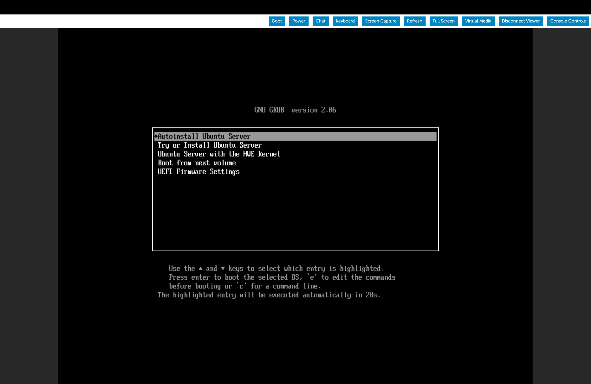

# Ubuntu Autoinstall ISO Guide

This guide explains how to create a custom autoinstall ISO for Ubuntu live server with pre-configured installation options.

## Reference Documentation

- **Ubuntu AutoInstall Documentation**: [Ubuntu AutoInstall Documentation](https://canonical-subiquity.readthedocs-hosted.com/en/latest/reference/autoinstall-reference.html)

## Prerequisites

Install the following packages:

- **7z**: For unpacking the source ISO, including partition images.

  ```bash
    sudo apt install p7zip
    ```

- **wget**: To download the latest daily build of the Ubuntu 22.04 server ISO.

  ```bash
    sudo apt install wget
    ```

- **xorriso**: For building the autoinstall custom ISO.

  ```bash
    sudo apt install xorriso
    ```

## Step-by-Step Guide

### Step 1: Move to the ISO Files directory and download the required version of Ubuntu

```bash
cd ~/lab/ansible/iso_files
mkdir source-files
wget https://releases.ubuntu.com/jammy/ubuntu-22.04.5-live-server-amd64.iso
```

From here on stay in the iso_files directory for all the rest of the commands.

### Step 2: Extract the ISO contents

Use 7z to unpack the ISO. It will extract MBR and EFI partition images automatically.

```bash
7z -y x ubuntu-22.04.5-live-server-amd64.iso -osource-files
```

### Step 3: Move the [BOOT] directory for easier access

```bash
cd source-files
mv '[BOOT]' ../BOOT
cd ..
```

### Step 4: Edit the ISO grub.cfg File

Open **source-files/boot/grub/grub.cfg** and add the following menu entry above the existing ones (it should be the first menuentry option).

This option will be shown during the Booting process and be automatically selected in 30 seconds, if there is no input from the user.


```bash
menuentry "Autoinstall Ubuntu Server" {
set gfxpayload=keep
linux   /casper/vmlinuz quiet autoinstall ds=nocloud\;s=/cdrom/server/  ---
initrd  /casper/initrd
}
```

Now, your grub.cfg file should look like 

### Step 5: Create a directory for auto-install configuration files

This directory will hold the user-data and meta-data files required to build the auto-install iso

```bash
mkdir source-files/server
```

### Step 6: Add an empty meta-data file (cloud-init requires its presence)

```bash
touch source-files/server/meta-data
```

### Step 7: Create a user-data file

This file will contain the auto-install user configuration. You can add your own settings here.

The below are the current settings(user-data) that we are using, you can refer to the Ubuntu Autoinstall documentation for more details.

```bash
autoinstall:
version: 1
early-commands:
    - ["cat", "/autoinstall.yaml"]
refresh-installer:
    update: yes
apt:
    preserve_sources_list: false
    mirror-selection:
    primary:
        - country-mirror
        - uri: "http://archive.ubuntu.com/ubuntu"
        arches: [i386, amd64]
        - uri: "http://ports.ubuntu.com/ubuntu-ports"
        arches: [s390x, arm64, armhf, powerpc, ppc64el, riscv64]
    fallback: abort
    geoip: true
    sources:
    git-ppa:
        source: ppa:git-core/ppa
identity:
    hostname: opi
    password: "hashedpassword"
    realname: opi
    username: opi
keyboard:
    layout: us
    toggle: ""
    variant: ""
locale: en_US
ssh:
    allow-pw: true
    authorized-keys: []
    install-server: true
storage:
    layout:
    name: lvm
    match:
        size: largest
late-commands:
    - 'echo ''APT::Install-Recommends "false";'' >/target/etc/apt/apt.conf.d/02InstallRecommends'
```

Under the Identity section, we need to provide a hashed password, which can be done using the following commands

```bash
openssl passwd -6
```

This will prompt you to enter a password, which will be hashed and displayed. You can then copy it to the autoinstall user-data file above.

### Step 8: Generate the Custom Ubuntu 22.04 Autoinstall ISO

To generate the custom Ubuntu 22.04 autoinstall ISO, you can use the following command

```bash
cd source-files

xorriso -as mkisofs -r \
-V 'Ubuntu 22.04 LTS AUTO (EFIBIOS)' \
-o ../ubuntu-22.04-autoinstall.iso \
--grub2-mbr ../BOOT/1-Boot-NoEmul.img \
-partition_offset 16 \
--mbr-force-bootable \
-append_partition 2 28732ac11ff8d211ba4b00a0c93ec93b ../BOOT/2-Boot-NoEmul.img \
-appended_part_as_gpt \
-iso_mbr_part_type a2a0d0ebe5b9334487c068b6b72699c7 \
-c '/boot.catalog' \
-b '/boot/grub/i386-pc/eltorito.img' \
    -no-emul-boot -boot-load-size 4 -boot-info-table --grub2-boot-info \
-eltorito-alt-boot \
-e '--interval:appended_partition_2:::' \
-no-emul-boot \
.
```

This will create a new autoinstall iso with the name: **ubuntu-22.04-autoinstall.iso**, that can be used for installation.
