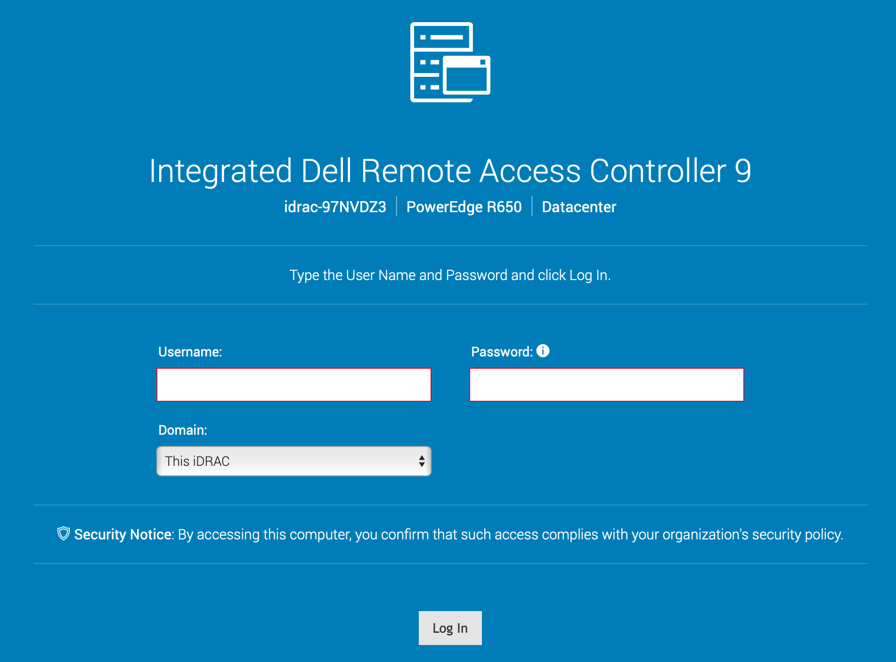
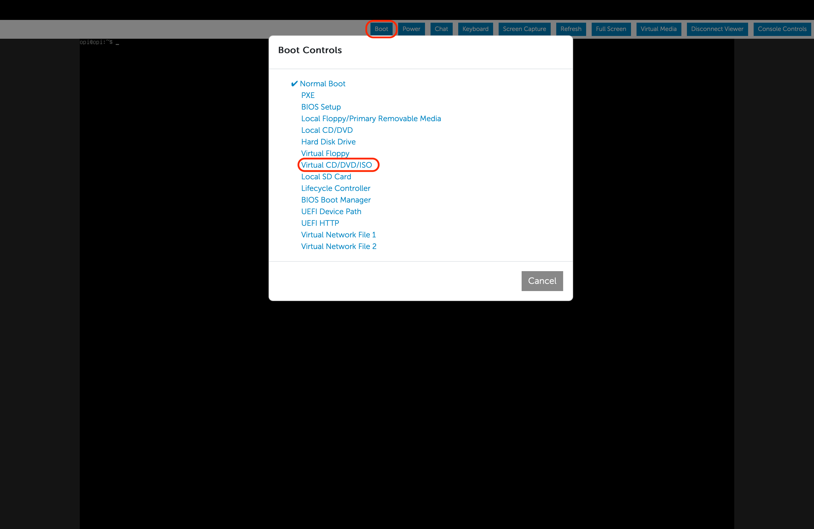
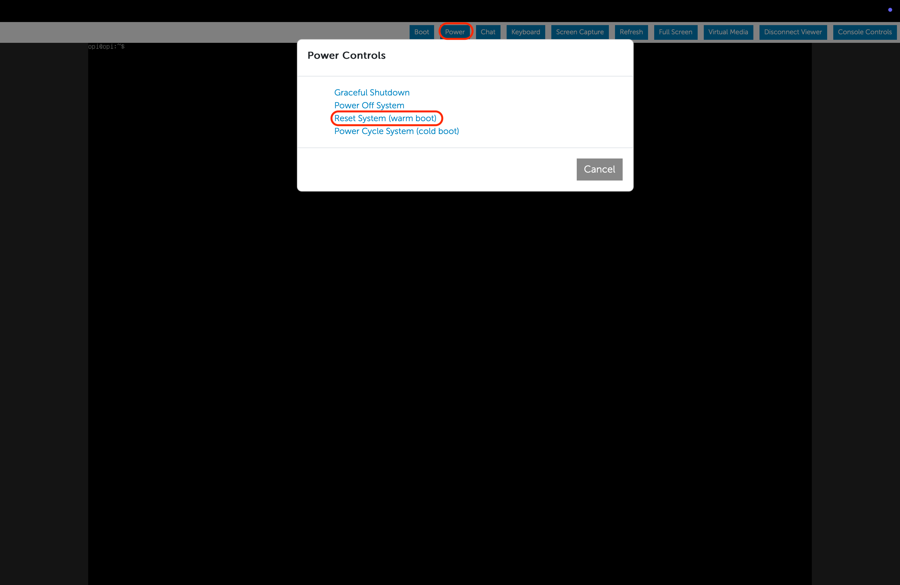
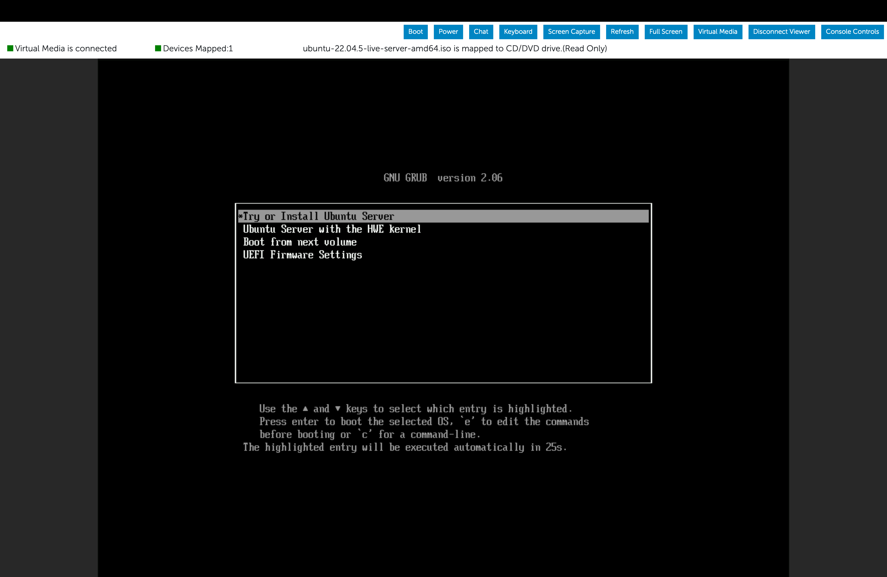

# OS Installation using iDRAC9 Web Interface using Remote File Share

This outlines the detailed steps to install an Operating System(OS) on a server using Dell’s iDRAC9 web interface using the Remote File Sharing method.

## Prerequisites

1. **iDRAC Login Credentials**: Ensure you have access to iDRAC9, incase you do not have the credentials, ask in the [OPI Slack group](https://join.slack.com/t/opi-project/shared_invite/zt-1ctqtrgkz-WJZrcVPp3P1ACZWjpZP2KQ).
2. **OS ISO File**: The Operating System ISO image should be available on the Network or a Remote File System and be accessible to the iDRAC system. The current Ubuntu ISO we are using is available at: `http://172.22.0.1/ubuntu-22.04.5-live-server-amd64.iso`. Please see [here](hosting_files_on_webserver.md) to understand how the ISO file is hosted on the web server.
3. **VPN Access**: Confirm you have a VPN connection to ensure, you can connect to the server's iDRAC interface.
4. **Supported Browsers**: Use the latest version of a supported web browser for the best experience (e.g., Chrome).

### Reference Documentation

- **Dell iDRAC9 User Guide**: [Dell iDRAC9 Documentation](https://dl.dell.com/topicspdf/44010ug_en-us.pdf)
- **Dell OS Deployment Overview**: [Dell iDRAC9 OS Deployment](https://www.dell.com/support/kbdoc/en-us/000130160/how-to-install-the-operating-system-on-a-dell-poweredge-server-os-deployment)
- **Dell iDRAC9 Remote File Sharing**: [Dell iDRAC9 Remote File Sharing OS Deployment](9_3.36.36.36_ug/deploying-operating-system-using-remote-file-share?guid=guid-fc3ef4b3-061f-44cf-b1a0-67861c7c1928&lang=en-us)

## Step-by-Step Guide

### Step 1: Access iDRAC9 Web Interface

1. Connect to the F5 VPN.
2. Open a web browser and enter the iDRAC IP address in the address bar. For example: `https://<iDRAC_IP>`.
3. Log in using the iDRAC credentials.

### Step 2: Connect the Remote File Sharing to iDRAC

1. Once you are successfully logged in to iDRAC console, Under configuration, go to **Virtual Media**.
2. Scroll down to go to **Remote File Share 1** or **Remote File Share 2**
3. Under **Remote File Share** fill out the details regarding the ISO file, like its path/address, username, password, SSL certificate (only the address is mandatory, rest are dependednt on the File Sharing system setup)
4. Once you have successfully filled out the parameters, click on connect and you will be able to see if iDRAC is able to connect or not.
5. Incase iDRAC is not able to access the ISO file, it shows an error to enter the correct details.

### Step 3: Launch the Virtual Console

1. From the iDRAC dashboard, navigate and launch the **Virtual Console** from the bottom right of the iDRAC dashboard and ensure you have the browser popups turned on.
2. This will open a new window with the server's user interface, and a couple of controls.

### Step 4: Configure Boot Settings

1. In the Virtual Console window, select **Boot** from the top menu bar.
2. Under the **Boot Controls**, set the virtual CD/DVD drive as the primary boot option. This ensures that the server boots from the mounted OS ISO.

### Step 5: Reboot the Server

1. In the Virtual Console window, select **Power** from the top menu bar.
2. Select **Reset System (warm reboot)**.
3. Confirm the reboot by clicking **OK**.

### Step 6: Boot into the OS Installer

1. During the server boot, monitor the Virtual Console window.
2. Once the server starts, it should boot into the mounted OS ISO and display the OS installation menu.

### Step 7: Follow the OS Installation Steps

1. Follow the on-screen prompts to proceed with the OS installation:

   - select all default options (unless otherwise noted below).
   - on disk setup: disable LVM.
   - on network setup: select `DHCP` for network settings.
   - on profile setup: use `opi` as the name, servername, username, and password for example purposes.
   - Donot install additional packages or software like Docker or databases.
   - on SSH setup: enable `install OpenSSH server`.

   Detailed steps are also available [here](https://github.com/opiproject/lab/blob/main/server-setup.md).

2. Once the OS is installed, remember to **disconnect** the network file share by going into the **Virtual Media console** as mentioned in Step 2 and under **Remote File Share**, click **Disconnect**.
3. Reboot the System.

