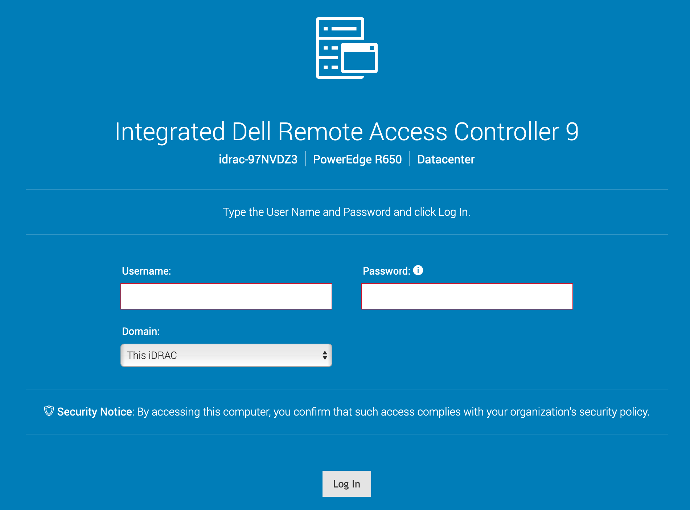
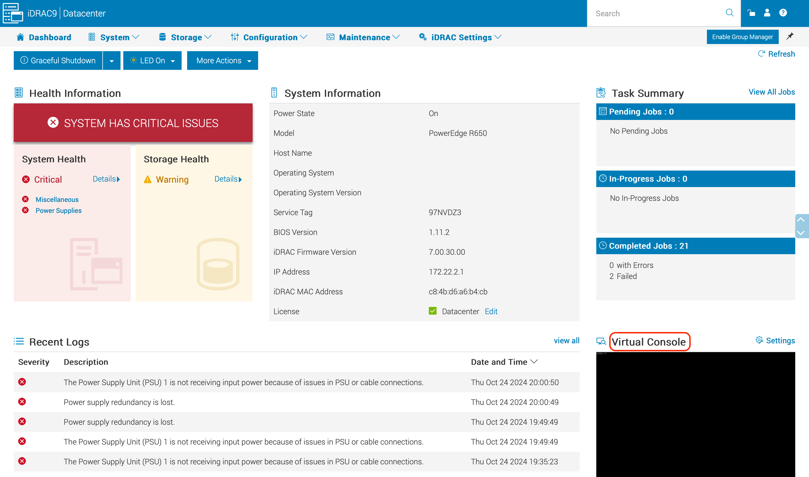
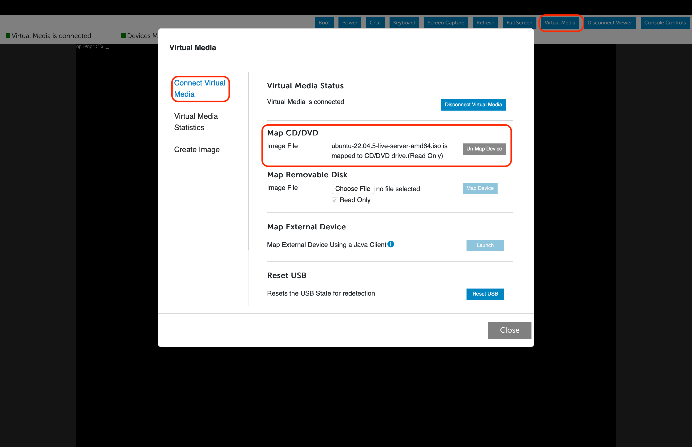
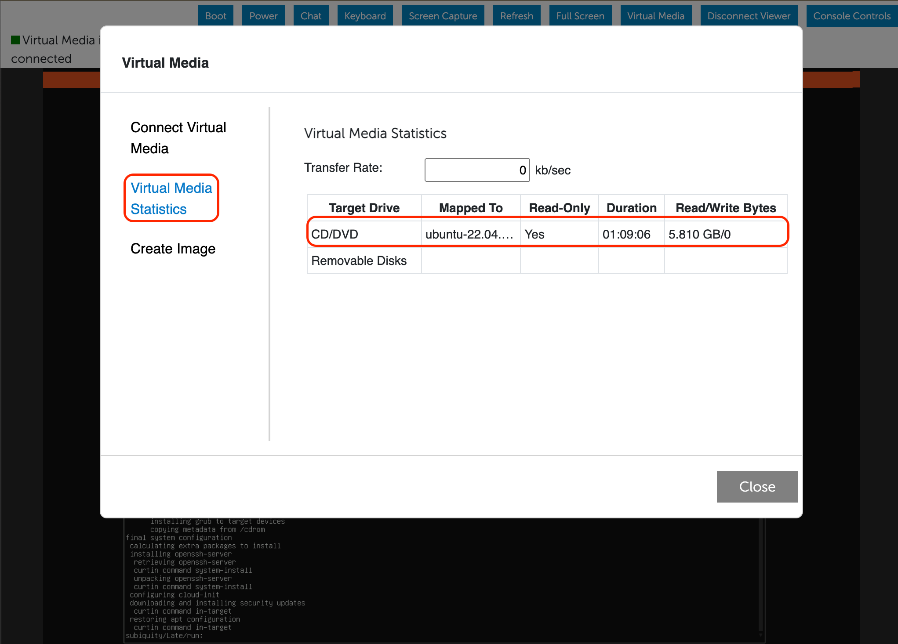
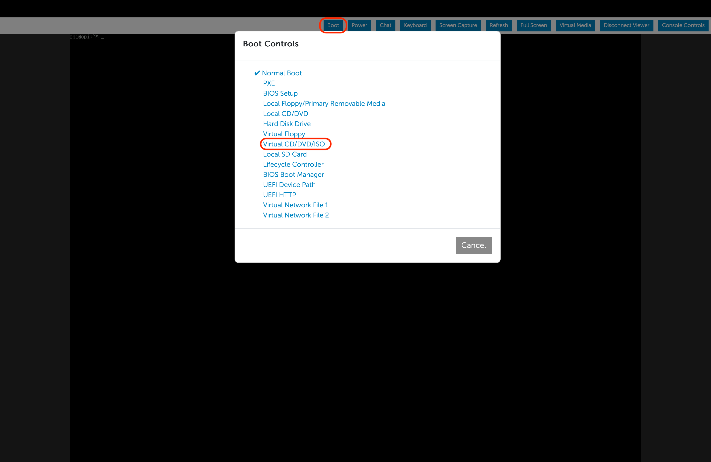
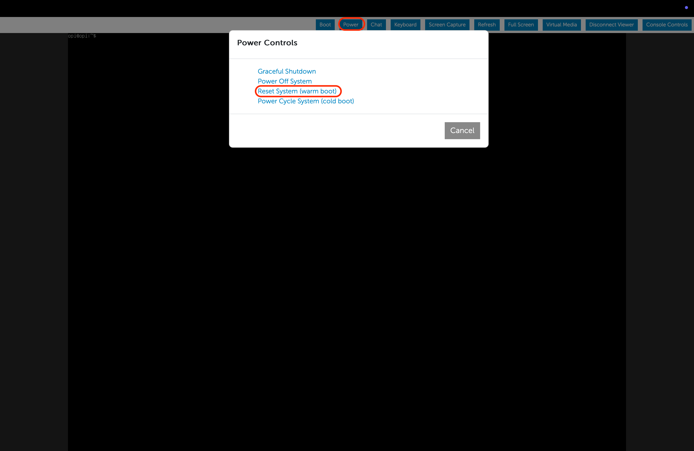
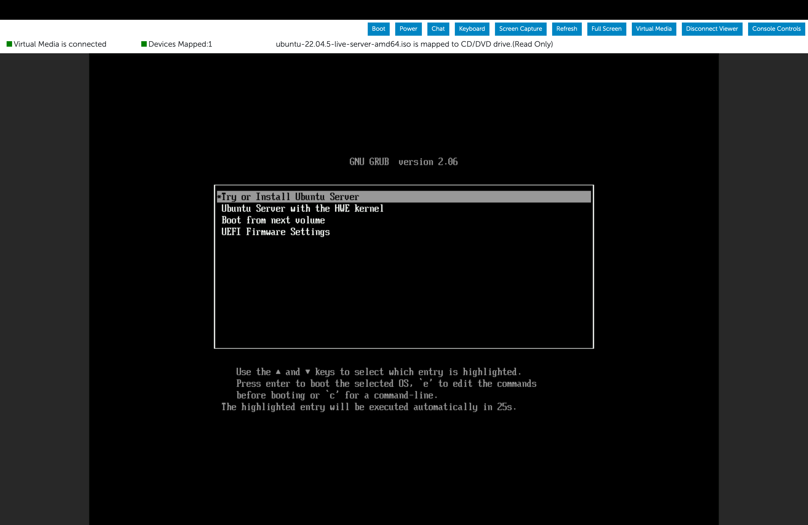
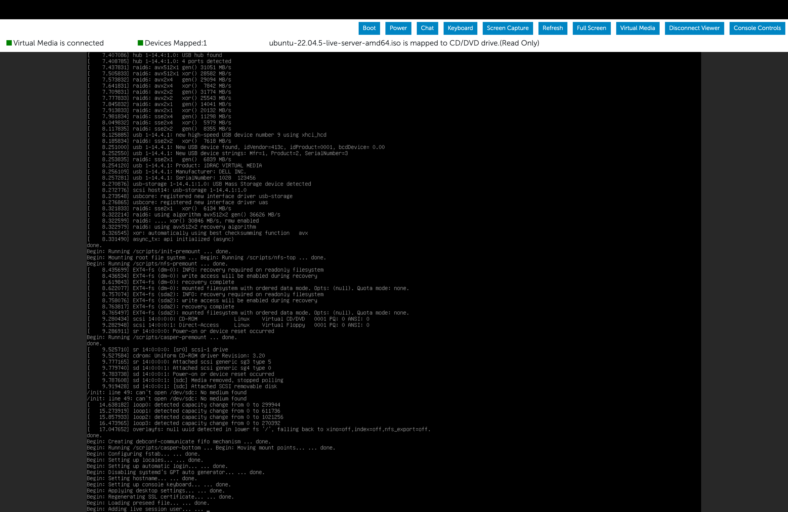

# OS Installation using iDRAC9 Web Interface

This outlines the detailed steps to install an Operating System(OS) on a server using Dell’s iDRAC9 web interface using the Virtual Media (file on your local machine).

## Prerequisites

1. **iDRAC Login Credentials**: Ensure you have access to iDRAC9, incase you do not have the credentials, ask in the [OPI Slack group](https://join.slack.com/t/opi-project/shared_invite/zt-1ctqtrgkz-WJZrcVPp3P1ACZWjpZP2KQ).
2. **OS ISO File**: The Operating System ISO image should be downloaded and accessible in your local file system.
3. **VPN Access**: Confirm you have a VPN connection to ensure, you can connect to the server's iDRAC interface.
4. **Supported Browsers**: Use the latest version of a supported web browser for the best experience (e.g., Chrome).

### Reference Documentation

- **Dell iDRAC9 User Guide**: [Dell iDRAC9 Documentation](https://dl.dell.com/topicspdf/44010ug_en-us.pdf)
- **Dell OS Deployment Overview**: [Dell iDRAC9 OS Deployment](https://www.dell.com/support/kbdoc/en-us/000130160/how-to-install-the-operating-system-on-a-dell-poweredge-server-os-deployment)

## Step-by-Step Guide

### Step 1: Access iDRAC9 Web Interface

1. Connect to the F5 VPN.
2. Open a web browser and enter the iDRAC IP address in the address bar. For example: `https://<iDRAC_IP>`.
3. Log in using the iDRAC credentials.

### Step 2: Launch the Virtual Console

1. From the iDRAC dashboard, navigate and launch the **Virtual Console** from the bottom right of the iDRAC dashboard and ensure you have the browser popups turned on.
2. This will open a new window with the server's user interface, and a couple of controls.

### Step 3: Mount the OS ISO

1. In the Virtual Console window, select **Virtual Media** from the top menu bar.
2. Choose **Connect Virtual Media** to enable virtual media features.
3. Click **Map CD/DVD** and select the Operating System ISO file from your local system and map the device.
4. Under the Virtual Media Statistics, you will be able to find the Read/Write status, wait until the entire ISO file is read completely, i.e., ~1 hour (until there is no change in the file size).

### Step 4: Configure Boot Settings

1. In the Virtual Console window, select **Boot** from the top menu bar.
2. Under the **Boot Controls**, set the virtual CD/DVD drive as the primary boot option. This ensures that the server boots from the mounted OS ISO.

### Step 5: Reboot the Server

1. In the Virtual Console window, select **Power** from the top menu bar.
2. Select **Reset System (warm reboot)**.
3. Confirm the reboot by clicking **OK**.

### Step 6: Boot into the OS Installer

1. During the server boot, monitor the Virtual Console window.
2. Once the server starts, it should boot into the mounted OS ISO and display the OS installation menu.

### Step 7: Follow the OS Installation Steps

1. Follow the on-screen prompts to proceed with the OS installation:

   - select all default options (unless otherwise noted below).
   - on disk setup: disable LVM.
   - on network setup: select `DHCP` for network settings.
   - on profile setup: use `opi` as the name, servername, username, and password for example purposes.
   - Donot install additional packages or software like Docker or databases.
   - on SSH setup: enable `install OpenSSH server`.

   Detailed steps are also available [here](https://github.com/opiproject/lab/blob/main/server-setup.md).

2. Once the OS is installed, remember to **disconnect** the virtual media by selecting **Virtual Media** > **Disconnect Virtual Media**.
3. Reboot the System.

## Troubleshooting Tips

- If the ISO doesn’t mount or the Attach Virtual Media Console doesn’t launch, verify that:
  - **Virtual Media** is enabled in the iDRAC settings.
  - Your network connection is stable.
  - The iDRAC firmware is up to date.
- If the issue still persists, do the following steps:
  - Clear your browser cache.
  - Restart iDRAC console.
