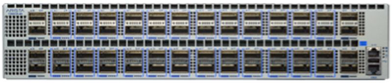
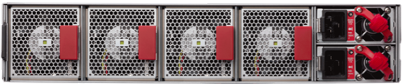

# 100G Switch

This device is intended to mold the test traffic between the trafic generators and the devices under test

## HW spec

Arista 7280R, 48x100GbE QSFP and 8x40GbE QSFP+ switch, front to rear air, 2 x AC and 2 x C19-C20 cords

- Part number: Arista DCS-7280CR-48-F
- Hardware version: 11.01
- Software image version: 4.20.10M

```bash
A100G#show version
Arista DCS-7280CR-48-F
Hardware version:    11.01
Serial number:       JPE16491339
System MAC address:  444c.a897.b5cf
 
Software image version: 4.20.10M
Architecture:           i386
Internal build version: 4.20.10M-10040268.42010M
Internal build ID:      5ba83857-5952-4713-b850-6e3c7c79cac3
 
Uptime:                 4 weeks, 6 days, 19 hours and 1 minutes
Total memory:           15992160 kB
Free memory:            13583756 kB
```

## Management

- serial port
- 1G ethernet management port

## gNMI

```bash
enable
configure
management api gnmi
   transport grpc openmgmt
      port 5900
```

and

```bash
A100G#show management api gnmi
Enabled:            Yes
Server:             running on port 5900, in default VRF
SSL Profile:        none
```

test

```bash
root@dh1:~# docker run --network host --rm ghcr.io/openconfig/gnmic get --log --username arista --password arista --insecure --address 172.22.1.250 --port 5900 --path /openconfig-interfaces:interfaces/interface[name=Management1]/state
2024/05/16 18:50:27.749705 [gnmic] version=0.37.0, commit=05a3e785, date=2024-05-13T23:27:31Z, gitURL=https://github.com/openconfig/gnmic, docs=https://gnmic.openconfig.net
2024/05/16 18:50:27.749742 [gnmic] using config file ""
2024/05/16 18:50:27.750028 [gnmic] sending gNMI GetRequest: prefix='<nil>', path='[elem:{name:"openconfig-interfaces:interfaces"}  elem:{name:"interface"  key:{key:"name"  value:"Management1"}}  elem:{name:"state"}]', type='ALL', encoding='JSON', models='[]', extension='[]' to 172.22.1.250
2024/05/16 18:50:27.750656 [gnmic] creating gRPC client for target "172.22.1.250"
[
  {
    "source": "172.22.1.250",
    "time": "1970-01-01T00:00:00Z",
    "updates": [
      {
        "Path": "interfaces/interface[name=Management1]/state",
        "values": {
          "interfaces/interface/state": {
            "arista-intf-augments:inactive": false,
            "openconfig-interfaces:admin-status": "UP",
            "openconfig-interfaces:counters": {
              "in-broadcast-pkts": "36076006",
              "in-discards": "0",
              "in-errors": "0",
              "in-multicast-pkts": "184661",
              "in-octets": "10041381967",
              "in-unicast-pkts": "93505125",
              "out-broadcast-pkts": "8649",
              "out-discards": "0",
              "out-errors": "0",
              "out-multicast-pkts": "184034",
              "out-octets": "23569377019",
              "out-unicast-pkts": "116336808"
            },
            "openconfig-interfaces:description": "",
            "openconfig-interfaces:enabled": true,
            "openconfig-interfaces:ifindex": 999001,
            "openconfig-interfaces:last-change": "171036192364",
            "openconfig-interfaces:mtu": 0,
            "openconfig-interfaces:name": "Management1",
            "openconfig-interfaces:oper-status": "UP",
            "openconfig-interfaces:type": "ethernetCsmacd"
          }
        }
      }
    ]
  }
]
```

## Docs

[7280R-DataSheet](https://www.arista.com/assets/data/pdf/Datasheets/7280R-DataSheet.pdf)

## Config

[Config](arista.config)

## Pictures




