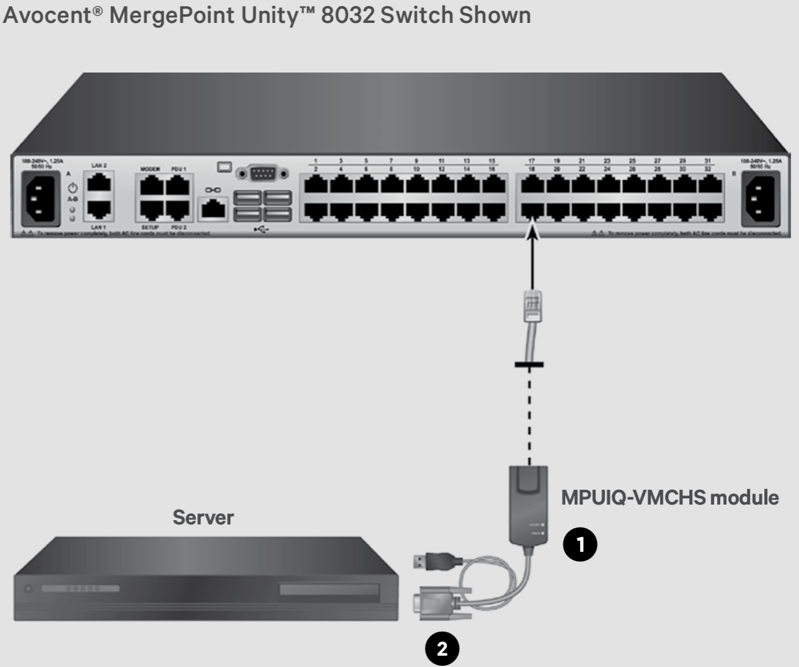

# Keyboard Video Mouse Switch

KVM switches provide remote management to access and control servers.

## HW spec

- Part Number: MPU8032DAC-35-B4-3E
- Version: 2.12.4.26064
- KVM dongle: MPUIQ-VMCHS

## Management

- serial port (SETUP)
- 1G ethernet management port

## Docs

[User guide](https://www.vertiv.com/4a6ff9/globalassets/shared/mergepoint-unity-kvm-over-ip-and-serial-console-switch-installeruser-guide_00.pdf)

## Pictures

