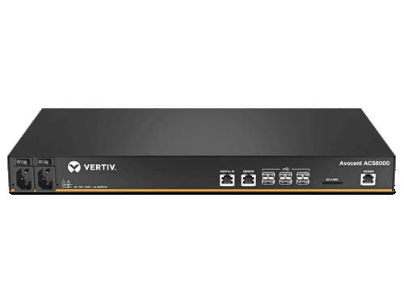
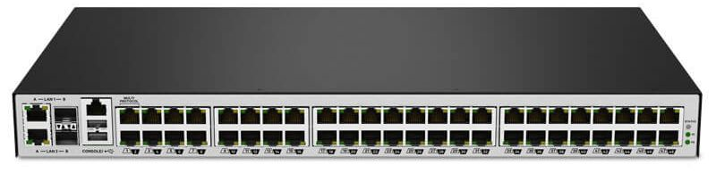

# Serial Consoles

IP to serial switch for remote access to the devices serial port
ACS8000 48-port unit dual AC power supply

## HW spec

- Part Number: ACS8048DAC-400
- Firmware: 2.26.1.5874+902+37+17 (Nov 7 2023 - 11:53:23)

## Management

- 1G ethernet management port

## Docs

[User guide](https://www.vertiv.com/49db15/globalassets/shared/avocent-acs-8000-installer-userguide.pdf)

## Devices connected

- Network PDU
- 100G Switch
- KVM

## Pictures

