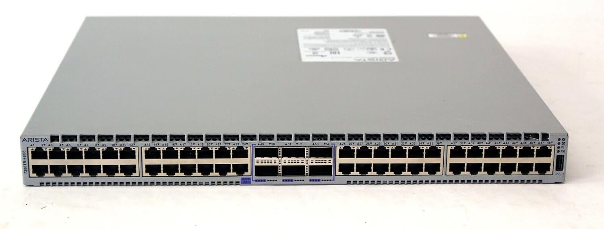
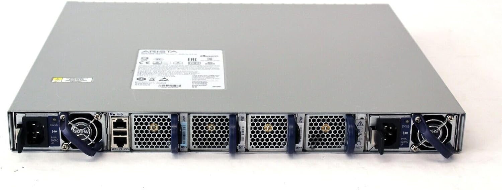

# Top of Rack

ToR switch/router provides network conectivity for management and access to the lab devices. All non test traffic goes through this device.

## HW spec

- Part Number: Arista DCS-7280TR-48C6-R
- Hardware version: 11.04
- Software image version: 4.22.3M

```bash
tor>show vers
Arista DCS-7280TR-48C6-R
Hardware version:    11.04
Serial number:       SSJ18302393
System MAC address:  2899.3a9c.3965

Software image version: 4.22.3M
Architecture:           i686
Internal build version: 4.22.3M-14418192.4223M
Internal build ID:      a077fcd6-7c48-4b5d-9d76-bd5f7a250bd5

Uptime:                 16 weeks, 2 days, 6 hours and 37 minutes
Total memory:           8104364 kB
Free memory:            6384448 kB
```

## Management

- serial port
- 1G ethernet management port

## gNMI

```bash
enable
configure
management api gnmi
   transport grpc openmgmt
      port 5900
```

and

```bash
tor#show management api gnmi
Enabled:            Yes
Server:             running on port 5900, in default VRF
SSL Profile:        none
```

test

```bash
root@dh1:~# docker run --network host --rm ghcr.io/openconfig/gnmic get --log --username arista --password arista --insecure --address 172.22.0.5 --port 5900 --path /openconfig-interfaces:interfaces/interface[name=Management1]/state
2024/05/16 18:52:10.247944 [gnmic] version=0.37.0, commit=05a3e785, date=2024-05-13T23:27:31Z, gitURL=https://github.com/openconfig/gnmic, docs=https://gnmic.openconfig.net
2024/05/16 18:52:10.248005 [gnmic] using config file ""
2024/05/16 18:52:10.248420 [gnmic] sending gNMI GetRequest: prefix='<nil>', path='[elem:{name:"openconfig-interfaces:interfaces"}  elem:{name:"interface"  key:{key:"name"  value:"Management1"}}  elem:{name:"state"}]', type='ALL', encoding='JSON', models='[]', extension='[]' to 172.22.0.5
2024/05/16 18:52:10.249123 [gnmic] creating gRPC client for target "172.22.0.5"
[
  {
    "source": "172.22.0.5",
    "time": "1970-01-01T00:00:00Z",
    "updates": [
      {
        "Path": "interfaces/interface[name=Management1]/state",
        "values": {
          "interfaces/interface/state": {
            "arista-intf-augments:inactive": false,
            "openconfig-interfaces:admin-status": "UP",
            "openconfig-interfaces:counters": {
              "in-broadcast-pkts": "52578878",
              "in-discards": "0",
              "in-errors": "0",
              "in-multicast-pkts": "332586",
              "in-octets": "4134370723",
              "in-unicast-pkts": "5137160",
              "out-broadcast-pkts": "43",
              "out-discards": "0",
              "out-errors": "0",
              "out-multicast-pkts": "331867",
              "out-octets": "1259190372",
              "out-unicast-pkts": "5140141"
            },
            "openconfig-interfaces:description": "",
            "openconfig-interfaces:enabled": true,
            "openconfig-interfaces:ifindex": 999001,
            "openconfig-interfaces:last-change": "170595730184",
            "openconfig-interfaces:loopback-mode": false,
            "openconfig-interfaces:mtu": 0,
            "openconfig-interfaces:name": "Management1",
            "openconfig-interfaces:oper-status": "UP",
            "openconfig-interfaces:type": "iana-if-type:ethernetCsmacd",
            "openconfig-vlan:tpid": "openconfig-vlan-types:TPID_0X8100"
          }
        }
      }
    ]
  }
]
```

## Docs

[Data Sheet](https://www.arista.com/assets/data/pdf/Datasheets/7280R-DataSheet.pdf)

## Pictures




