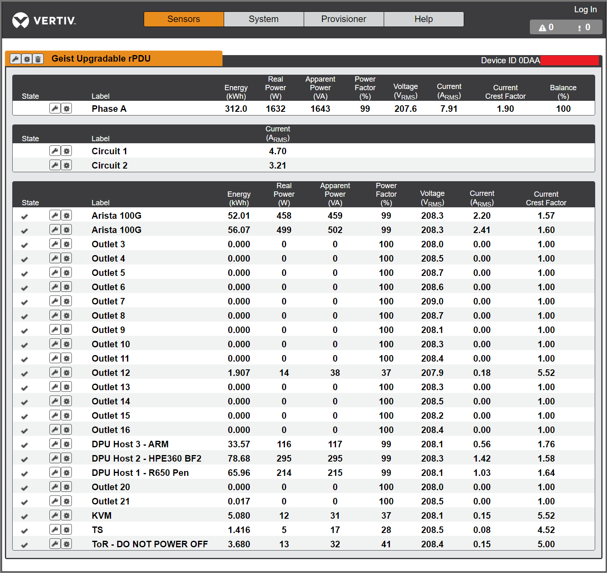

# Network controled power delivery unit

This device is intended to provide remote capability to cold boot the lab devices
When all hopes are lost bring down and up the power and you may recover your device

## HW spec

Upgradeable Switched Outlet Level Monitored rPDUs provide reliable power distribution to critical IT equipment while delivering individual outlet level control and a comprehensive view of outlet level power usage via remote network access.

- Part Number: VP7N3001
- Model Number: MNU3EGB1-24CF18-3TL6A0A10-S
- Version: 5.10.8

## Management

- serial port
- 1G ethernet management port

## Docs

[User guide](https://www.geistglobal.com/sites/all/files/Manuals/vm1221_590-2196-501a.pdf)

## Pictures

